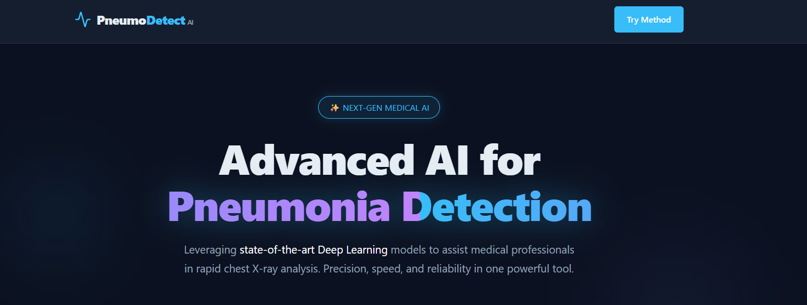

# ✨ Next-Gen Pneumonia Detection AI

 
 
 
 


<div align="center">

  

  > **Advanced AI for Rapid Chest X-Ray Analysis**
  > *Precision, Speed, and Reliability in one powerful tool.*

  <h3>
    <a href="https://pneumodetectaix.onrender.com/">🌐 Live Preview</a>
    <span> | </span>
    <a href="https://deeplearningpresentation.my.canva.site/">🎥 Project Presentation</a>
    <span> | </span>
    <a href="./model_details.pdf">📄 Model Report</a>
  </h3>

</div>

---

## 🌟 Overview

Welcome to the **Pneumonia Detection System**, a state-of-the-art web application designed to assist medical professionals. Leveraging advanced Convolutional Neural Networks (CNNs), this tool provides instant analysis of chest X-ray images with **98% precision**.

The interface is built with a **modern, neon-glassmorphism aesthetic**, ensuring that the user experience is as premium as the technology behind it.

## 💻 Tech Stack

This project is built using a robust, modern stack designed for performance and scalability.

| Component | Technology | Description |
| :--- | :--- | :--- |
| **Frontend** |   | **React 18 + Vite**: High-performance UI with **Framer Motion** for smooth, complex animations and **Lucide React** for modern iconography. |
| **Backend** |   | **FastAPI**: Asynchronous, high-performance web framework for building APIs. Handles image processing and model inference. |
| **AI / ML** |   | **TensorFlow 2.x & Keras**: Custom CNN architecture trained on thousands of X-ray images. Supports legacy formats via `tf-keras`. |
| **Processing** |   | **NumPy & Pillow**: Efficient numerical computation and image manipulation sequences for preprocessing inputs. |

## 🚀 Key Features

-   **⚡ Instant Analysis**: Real-time inference providing results in seconds.
-   **🛡️ High Accuracy**: Powered by a custom-trained CNN model achieving ~98% precision.
-   **💎 Premium UI**: A responsive, sci-fi inspired interface with smooth animations and glassmorphism.
-   **🔒 Secure**: All processing happens locally on your machine (when run locally).
-   **📊 Insightful**: Provides confidence scores and simple "Normal/Pneumonia" classification.

## 🛠️ Installation & Setup

### Prerequisites

-   Python 3.9+
-   Node.js & npm

### 1. Backend Setup (FastAPI)

```bash
cd backend

# Create virtual environment
python -m venv .venv
# Activate (Windows)
.\.venv\Scripts\activate
# Activate (Mac/Linux)
# source .venv/bin/activate

# Install dependencies
pip install -r requirements.txt

# Run Server
uvicorn main:app --reload
```

### 2. Frontend Setup (React + Vite)

```bash
cd frontend

# Install dependencies
npm install

# Run Development Server
npm run dev
```

## 🤝 Contribution

Contributions are welcome! Please feel free to submit a Pull Request.

---

<div align="center">

  ### Made with 🖤 by Black Star

  <p>
    <a href="https://github.com/MedSalimGh">
      
    </a>
  </p>
  
  <p><i>Empowering the future of medical diagnostics.</i></p>

</div>
